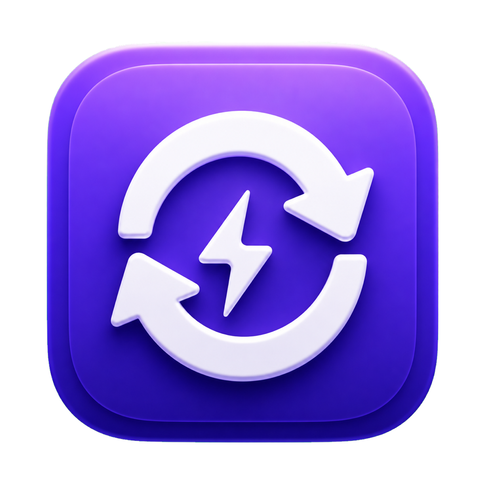

# Volta Auto Update

<p align="center">
  
</p>

<p align="center">
  自动检查并更新由 <a href="https://volta.sh/">Volta</a> 管理的 npm 开发工具。<br>
  Automatically update Volta-managed npm developer tools with a macOS app, CLI, and launchd scheduler.
</p>

<p align="center">
  
  
  
  
</p>

Volta Auto Update 是一个面向 macOS 的 Volta 工具自动更新器。它可以比较本地版本与 npm registry 最新版本，并通过 `volta install <package>@latest` 更新 Codex、Claude Code、OpenCode 等命令行开发工具。

## 为什么使用它

- **原生 macOS App**：SwiftUI 控制面板和菜单栏入口，无需常驻主窗口。
- **每日自动更新**：使用用户级 `launchd` 调度，默认每天 09:00，可自定义时间。
- **休眠后补跑**：错过计划时间时，可在 Mac 唤醒或重新登录后执行；每天最多自动运行一次。
- **CLI 与双击运行**：既可在终端执行，也可双击 `.command` 文件。
- **自定义工具列表**：从 App 中添加或删除任意合法的 npm 包。
- **容错执行**：单个工具更新失败或网络异常不会阻止其他工具继续检查。
- **Homebrew 兼容**：支持 Volta 官方安装目录以及 Apple Silicon、Intel Mac 的 Homebrew 路径。

## 默认管理的工具

| 工具 | npm 包 | 默认命令 |
| --- | --- | --- |
| OpenAI Codex | `@openai/codex` | `codex` |
| Claude Code | `@anthropic-ai/claude-code` | `claude` |
| OpenCode | `opencode-ai` | `opencode` |

工具需要先通过 Volta 安装。未安装的工具会被标记并跳过，不会由本项目自动首次安装。

## 快速开始

### 环境要求

- macOS 13.0 或更高版本（原生 App）
- Volta 2.0 或更高版本
- 网络连接，用于访问 npm registry
- 构建 App 时需要 Xcode Command Line Tools / Swift 工具链

如果尚未安装 Volta，可选择一种方式：

```bash
# Volta 官方安装脚本
curl https://get.volta.sh | bash

# 或使用 Homebrew
brew install volta
```

确认安装成功：

```bash
volta --version
```

### 获取项目

```bash
git clone https://github.com/zhexin233-ui/volta-auto-update.git
cd volta-auto-update
```

## 使用方式

### 1. 终端运行

```bash
./update-volta-tools.sh
```

脚本会检查全部已配置工具，显示当前版本与最新版本，并更新存在新版本的工具。

### 2. 双击运行

在 Finder 中双击 `update-volta-tools.command`。运行结果会显示在终端窗口中，按任意键后关闭。

### 3. 原生 macOS App

构建 App：

```bash
./macos-app/build-app.sh
```

构建产物位于 `dist/Volta 自动更新.app`。首次使用时可将其拖入“应用程序”目录，然后打开：

```bash
open "dist/Volta 自动更新.app"
```

控制面板支持：

- 查看工具的当前版本与最新版本
- 立即执行检查和更新
- 新增或删除需要管理的 npm 工具
- 启用、停用或修改每日调度时间
- 查看最近一次运行状态与完整日志
- 从菜单栏快速打开面板或执行更新

## 自动调度

App 使用用户级 LaunchAgent，不要求 App 持续运行。启用后会创建：

```text
~/Library/LaunchAgents/com.zhexin.volta-auto-update.scheduler.plist
```

默认执行时间为每天 `09:00`。手动执行不受“每天一次”限制，但同一时间只允许一个更新任务运行。

## 工作原理

```text
volta list all
      ↓
读取本地安装版本
      ↓
请求 registry.npmjs.org/<package>/latest
      ↓
比较版本并执行 volta install <package>@latest
      ↓
记录状态与日志
```

- `volta list all`：读取 Volta 管理的工具及其版本。
- npm registry API：查询每个包的最新稳定版本。
- `volta install`：使用 Volta 更新工具，并保留 Volta 的运行时管理方式。
- Bash 3.2+：兼容 macOS 系统自带 Bash。
- SwiftUI：提供原生控制面板与菜单栏界面。
- `launchd`：提供用户级每日自动调度。

## 配置与数据目录

| 内容 | 路径 |
| --- | --- |
| 工具配置 | `~/Library/Application Support/Volta Auto Update/tools.tsv` |
| 更新日志 | `~/Library/Application Support/Volta Auto Update/Logs/update.log` |
| 运行状态 | `~/Library/Application Support/Volta Auto Update/status.json` |
| 调度时间 | `~/Library/Application Support/Volta Auto Update/schedule-time` |
| LaunchAgent | `~/Library/LaunchAgents/com.zhexin.volta-auto-update.scheduler.plist` |

工具配置使用制表符分隔，每行格式为：

```text
npm-package<TAB>显示名称
```

建议通过 App 修改工具列表，以便自动校验包名和重复项。

## 常见问题

### 已安装 Volta，但提示“Volta 未安装”

先在终端检查：

```bash
command -v volta
volta --version
```

项目会依次从以下位置查找 Volta：

1. 当前 `PATH`
2. `$VOLTA_HOME/bin/volta`
3. `~/.volta/bin/volta`
4. `$HOMEBREW_PREFIX/bin/volta`
5. `/opt/homebrew/bin/volta`（Apple Silicon）
6. `/usr/local/bin/volta`（Intel Mac）

如果终端可以找到 Volta，但旧版 App 仍然误报，请重新构建并替换“应用程序”目录中的 App；App 会从自身资源同步实际执行脚本。

### 网络请求失败

网络错误会被记录并跳过当前工具，其他工具仍会继续检查。可在 App 内打开日志，或查看：

```text
~/Library/Application Support/Volta Auto Update/Logs/update.log
```

### 工具显示“未安装”

本项目只更新已由 Volta 管理的工具。请先手动安装，例如：

```bash
volta install @openai/codex
```

## 开发与测试

```bash
./tests/test-update-volta-tools.sh
./tests/test-scheduler-runtime.sh
swift build --package-path macos-app -c release
```

测试覆盖版本检查、网络和解析异常、连续更新、自定义工具、Volta 路径发现、每日调度、补跑、并发锁与 LaunchAgent 配置。

## 项目结构

```text
.
├── update-volta-tools.sh          # CLI 更新脚本
├── update-volta-tools.command     # Finder 双击入口
├── macos-app/                     # SwiftUI App 与 launchd 运行层
└── tests/                         # Shell 回归测试与 fixtures
```

## 贡献

欢迎提交 [Issue](https://github.com/zhexin233-ui/volta-auto-update/issues) 或 Pull Request。提交修改前请运行完整测试，并确保新增行为包含相应的回归测试。

## License

MIT
